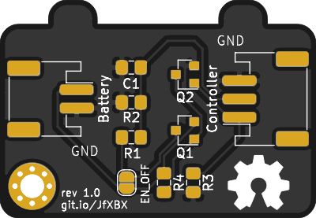

# Battery level monitor
The board is designed to measure the battery level (voltage) with an uC's ADC. The on-board voltage divider must be parameterized (R1 and R2) according to the uC's max ADC input as well as the battery's voltage level. The battery voltage may be higher then the ADC's Vcc.

The circuit includes two MOSFETs to cut-off the voltage divider in order to not drain the battery when not in use. The uC must pull up EN to activate the voltage divider. If EN is left floating (e.g., the uC is turned off or in deep-sleep), the on-board pulldown resistor cuts of the voltage divider.

## Parameterize voltage divider
Calculate the two resistors R1 and R2 to fit your application needs (e.g., use an [online calculator](http://www.ohmslawcalculator.com/voltage-divider-calculator)). Example:

| Battery | ADC input | R1 | R1 |
| -------- | -------- | -------- | -------- |
| 14V     | 3.3V     | 75k     | 18k |

(resistor values adjusted to match common resistor series)

## Connectors / headers / solder jumper

| Connector | Purpose |
| -------- | -------- |
| J1     | to uC - (1) EN, (2) ADC, (3) GND |
| J2     | to battery - (1) Vbat, (2) GND |
| JP1    | bridge to enable voltage divider permanetly |

## Build

The board is hand solderable with some practise. Components are 0805 and SOT23 footprint.

### Schematic

### Bill of materials (BOM)

| Designator | Manufacturer Part Number | Qty |
| -------- | -------- |	-------- |	
|J1 |	S3B-PH-SM4-TB(LF)(SN) |	1 |
|J2 |	S2B-PH-SM4-TB(LF)(SN) |	1 |
|R1 |	(must be calculated) 0805 |	1 |
|R2 |	(must be calculated) 0805 |	1 |
|R3 |	100k 0805|	1 |
|R4 |	10k 0805|	1 |
|C1 |	100nF 0805|	1 |
|Q1 |	BSS84 SOT23|	1 |
|Q2 |	BSS123 SOT23 |	1 |

### PCB Rendering
 | 
------------ | -------------
frontside rev 1.0 | backside rev 1.0

### Order PCBs
You can create gerber files (KiCad -> Plot) and upload them to the PCB manufacturer of your choice. You can also use this preconfigured [PCBs.io link](https://PCBs.io/share/4o5we) which will earn me some royalties.
